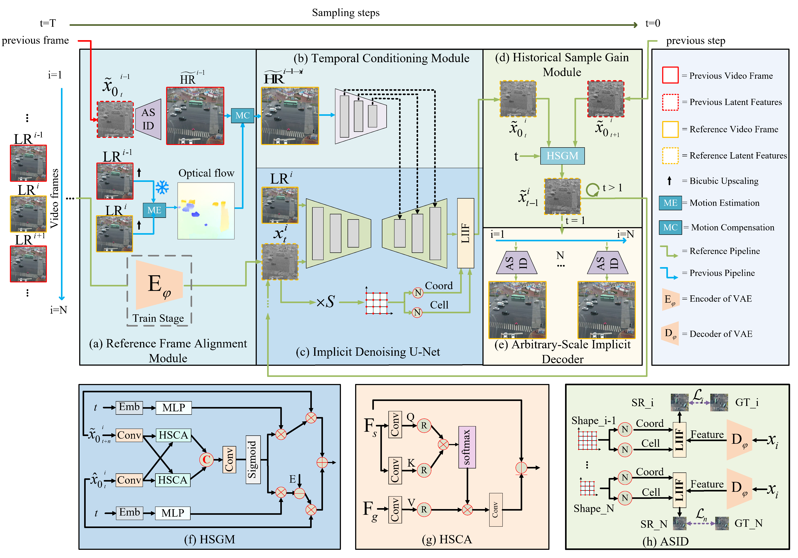
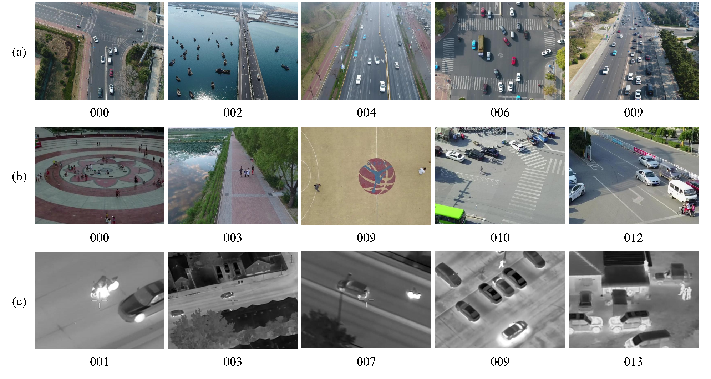

## This repository contains the official PyTorch implementation of our paper [TAIS-Net: Time Adaptive Implicit Sampling Diffusion Model for Arbitrary-Scale UAV Video Super-Resolution](""), accepted by the ISPRS Journal of Photogrammetry and Remote Sensing (ISPRS&RS).

##### Authors: Wenke Li, Chenguang Dai, Huixin Fan, Zhen Zhao, Kangrui Li, Yifan Sun, Yongsheng Zhang, Longguang Wang,Hanyun Wang 

---

### Abstract

Emerging applications urgently require UAV videos with high clarity and rich structural details. However, limitations in imaging sensors and non-ideal conditions often result in videos blur and lacking sufficient details. Recent studies indicate diffusion models have strong potential for natural scene video super-resolution (SR). However, applying diffusion models specifically to UAV video SR remains largely unexplored, especially for arbitrary-scale UAV video SR reconstruction. To tackle the challenges in UAV video SR at arbitrary scales, we introduce a time adaptive implicit sampling diffusion model TAIS-Net. First, to achieve robust temporal alignment under large camera motions and low-texture conditions commonly encountered in UAV videos, we use a reference frame alignment module to compensate previously reconstructed frames by incorporating motion cues estimated from a pre-trained optical flow model. Second, to enable scale-flexible reconstruction while preserving fine geometric details for UAV videos under arbitrary upscaling factors, we introduce a implicit denoising U-Net to learn latent features by leveraging implicit neural representations and a temporal conditioning module. Third, to reduce error accumulation during sampling, we introduce a historical sample gain module that dynamically corrects and refines latent features at each sampling step, thereby suppressing temporal artifacts such as flickering or drifting. Finally, an arbitrary-scale implicit decoder is used to reconstruct high-resolution videos directly from these enhanced latent features, avoiding scale-dependent blurring while preserving high-frequency details in UAV videos. To validate the effectiveness of TAIS-Net, we construct two visible and one infrared UAV video SR datasets. The experimental results on these datasets demonstrate that TAIS-Net achieves state-of-the-art (SOTA) performance in terms of reconstruction quality, perceptual quality and temporal consistency. Moreover, experiments on various motion intensities and additional Gaussian blur beyond conventional bicubic downsampling degradation without retraining also demonstrate the superiority of our TAIS-Net in maintaining perceptual and temporal consistency under real-world UAV scenarios.  

---


### Method



---

### Usage


#### Environment

The code is based on Python 3.8.17, CUDA 11, and [diffusers](https://github.com/huggingface/diffusers).


#### Conda setup

```bash
conda create -n TAISNet python=3.8.17 -y
git clone https://github.com/cyber-lwk/TAIS-Net
cd TAIS-Net
conda activate TAISNet
pip install -r requirements.txt
```


#### Datasets

Download the datasets from [here](https://pan.baidu.com/s/1SGodEizmznK_bsiDnXX_JA?pwd=0430)



#### Train

```bash
python train.py \
 --pretrained_model_name_or_path=$MODEL_ID \
 --pretrained_vae_model_name_or_path=$MODEL_ID \
 --output_dir=$OUTPUT_DIR \
 --dataset_config_path="dataset/config_uavdrone.yaml" \
 --learning_rate=5e-5 \
 --validation_steps=1000 \
 --train_batch_size=8 \
 --dataloader_num_workers=8 \
 --max_train_steps=100000
```


#### Test

```bash
python test.py --in_path YOUR_PATH_TO_LR_SEQS --out_path YOUR_OUTPUT_PATH --num_inference_steps 50 --controlnet_ckpt YOUR_PATH_TO_CONTROLNET_CKPT_FOLDER 
```


#### Evaluation

```bash
python eval.py --gt_path YOUR_PATH_TO_GT_SEQS --out_path YOUR_OUTPUT_PATH
```

---

### Acknowledgement
Our work is built upon [StableVSR](https://github.com/claudiom4sir/StableVSR).

Thanks to the author for the source code !

